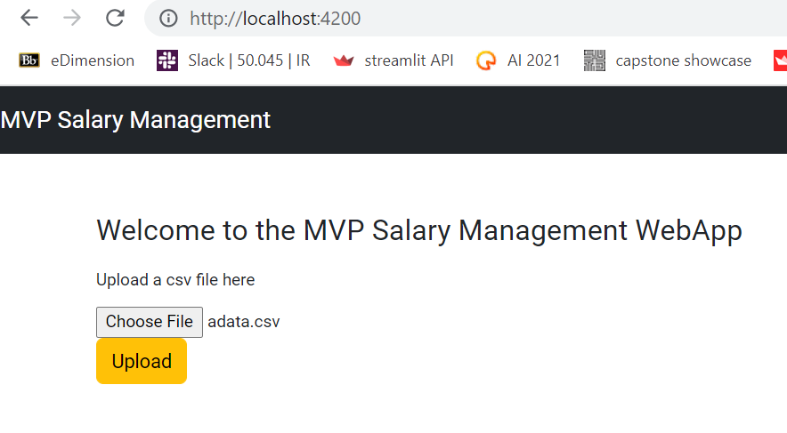
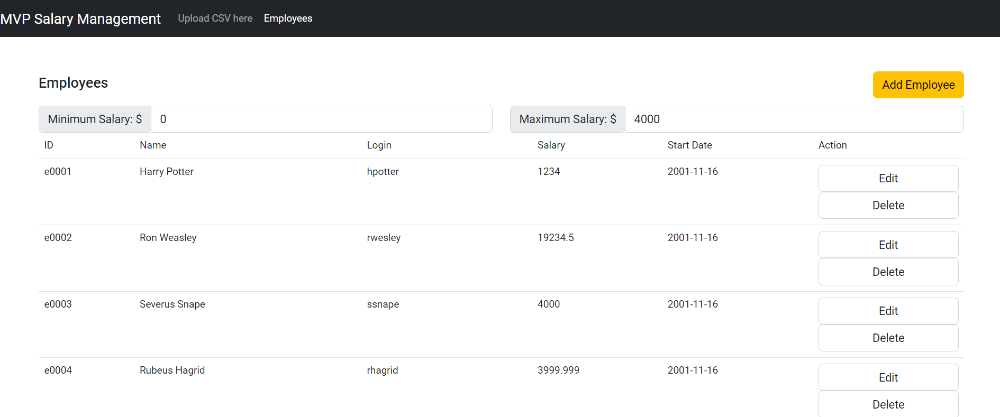
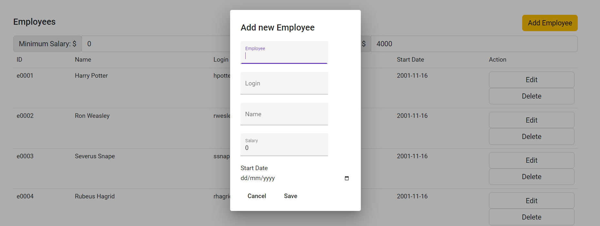
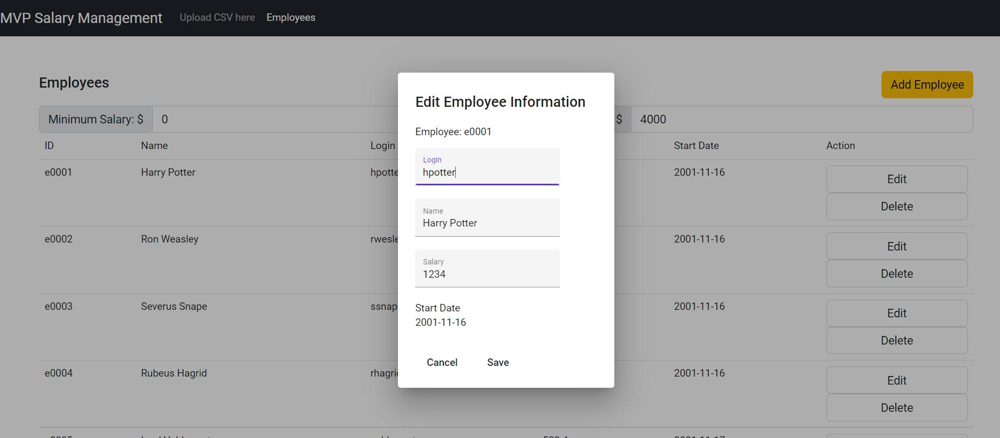

# Employee Salary Management

## MVP Salary Management Web Application
This is a employee salary management web application to help the HR department manage employees' salaries.

#

## User Story 1: Upload Users
- The csv file that contains the employees' data can be upload through the home page (upload CSV here) of the web app.

#

## User Story 2: Employee Dashboard Feature
- A list of the employees' information is displayed through the employee tab of the web app.
    - ID
    - Name
    - Login
    - Salary
    - Start Date
- Employees' data can be filtered through the minimum and maximum salary specified by user.
    - 
# 

## User Story 3: CRUD Feature
- From the last column of the Employee Dashboard, 2 buttons are available for user to edit or delete the employees' data.
- Create
    - Adding new employee into the database
    - 
- Edit
    - Edit the chosen employee from the front-end and the information will be updated at both the frontend and the backend
    - 
- Delete
    - Deletes the chosen employee data from the database
#

## How to use
1. SalaryManagement 
    - Rest API developed using Spring Boot
2. SalaryManagementWebApp
    - Front end developed using Angular web framework
